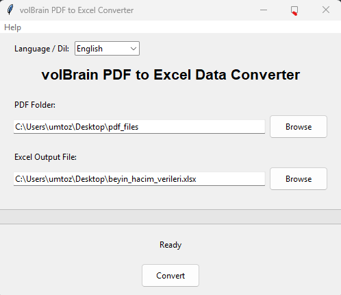
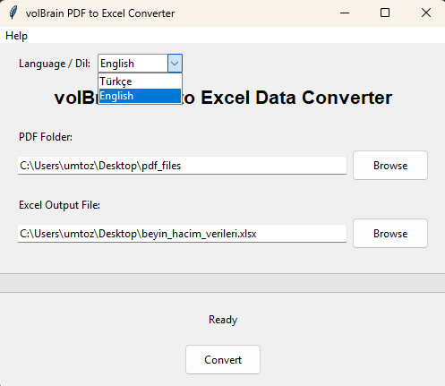
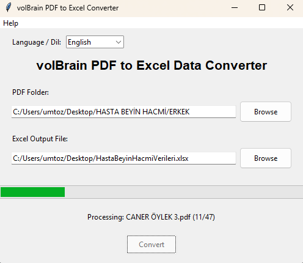
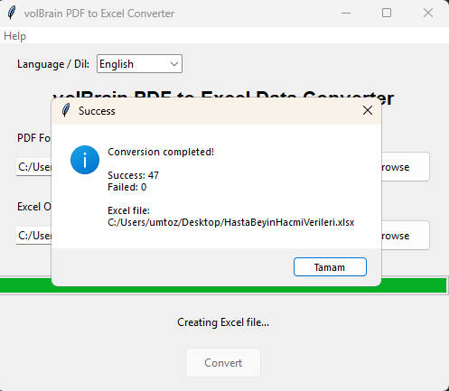
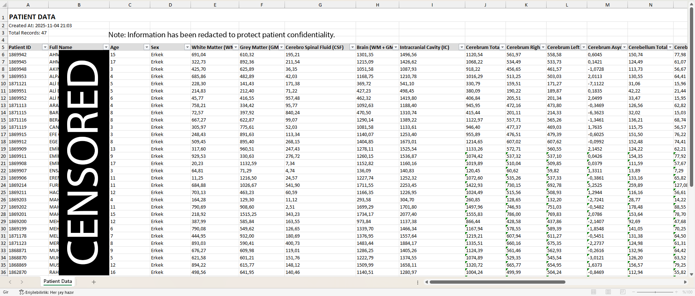
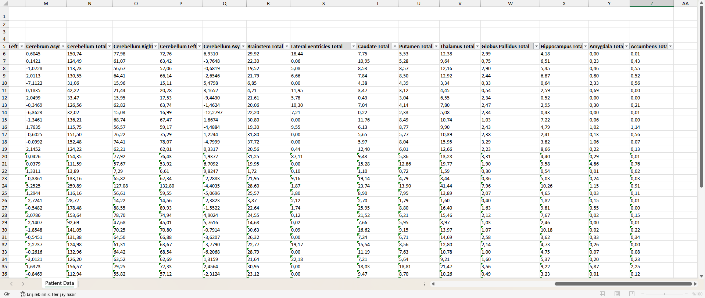

# 🧠 volBrain PDF to Excel Converter


**volBrain PDF to Excel** is a lightweight desktop application that converts **volBrain PDF reports** into structured and editable **Excel (.xlsx)** files.  
Built with **Python (Tkinter GUI)**, it now includes a **dual-language interface** — English ᴇɴ and Turkish 🇹🇷.

---

## 🚀 Features
- 🧾 **Automatic PDF Parsing** – Reads volBrain reports and exports clean Excel data  
- 🌐 **Dual Language Support** – English & Turkish interface (added in v1.1.0)  
- 💾 **Excel Export** – Converts and saves results as `.xlsx` files  
- ⚙️ **Offline Operation** – Works fully offline (no internet required)  
- 🪶 **Simple Interface** – Easy-to-use design for researchers and clinicians  

---

## 🛠️ Installation

### 🧩 Option 1 — Using Installer (Recommended)
1. Download the latest setup file from the [**Releases**](../../releases/latest) page  
2. Run `volBrain_PDF_to_Excel_Setup_1.1.0`  
3. Follow the setup wizard  
4. Launch the app from the **Start Menu** or your **Desktop shortcut**

> 🗒️ Installer type: All-users (requires admin privileges)

---

### 💻 Option 2 — Run from Source (Developers)

```bash
# Clone repository
git clone https://github.com/<your-username>/volBrainPDFtoExcel.git
cd volBrainPDFtoExcel

# Install dependencies
pip install pdfplumber openpyxl

# Run the app
python volbrainpdf2excel.py
```

---

## 💡 Usage

1. **Choose your PDF folder** (containing volBrain reports)  
2. **Select your Excel output file path**  
3. **Pick your interface language** (English / Türkçe)  
4. **Click Convert** → Done! ✅  

---

## 📦 Technical Details

| Component | Description |
|------------|-------------|
| **Language** | Python 3.13 |
| **Framework** | Tkinter GUI |
| **Packaging** | PyInstaller + Inno Setup |
| **Supported OS** | Windows 10 / 11 (x64) |
| **Output Format** | Excel `.xlsx` (via OpenPyXL) |

---

## 📁 Project Structure

```bash
volBrainPDFtoExcel/
├── 📂 Screenshots/
│   ├── ExcelTableEnglish.png
│   ├── ExcelTableEnglishP2.png
│   ├── LanguagesSelect.png
│   ├── MainEnglish.png
│   ├── ProgressBar.png
│   └── SuccessWindow.png
│
├── 📂 assets/
│   └── icon.ico
│
├── ⚙️ volbrainpdf2excel.py
├── 🧾 README.md
├── ⚙️ .gitattributes
└── ⚙️ .gitignore
```
---

## 🗓️ Version History

| Version | Date | Notes |
|----------|------|-------|
| **1.1.0** | 29 Oct 2025 | Added English interface; UI improvements |
| **1.0.0** | 15 Oct 2025 | Initial release — Turkish-only version |

---

## 📸 Screenshots

> UI and functional examples are shown below.  
> *(Some information has been redacted for patient confidentiality.)*

### 🏠 Main Window


### 🌐 Language Selection


### ⏳ Progress Bar


### ✅ Success Window


### 📊 Excel Export – Part 1


### 📊 Excel Export – Part 2



---

## ❤️ Credits

Created by **Umut Özcan**  
_“Turning neuroscience data into accessible insights.”_

---

## 📬 Feedback & Support

- Open an issue → [Issues](../../issues)  
- Feature requests & bug reports are welcome!  
- If you find this project useful, please give it a ⭐ on GitHub — it helps more people discover it.

## 🔑 License

This project is licensed under the [MIT License](https://choosealicense.com/licenses/mit/).

